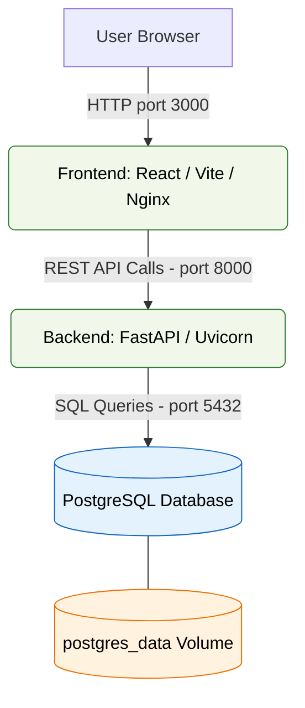
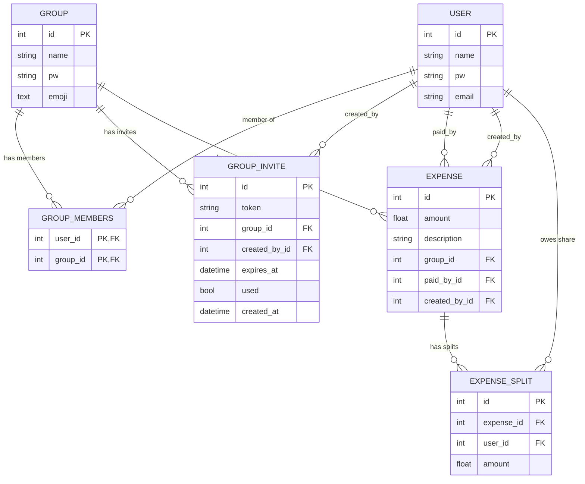

# MyCount Report

## Introduction
This project is a full-stack web application designed to help individuals both track and split their expenses within a group. It provides a structured backend for data management and a responsive and sleek frontend for user interaction.

---

## Core Features

1. **Group lifecycle API** — [View Endpoint](./backend/app/api/groups.py:23) — Allows users to create, join, and view shared expense groups through REST endpoints.

2. **Expense management API** — [View Endpoint](./backend/app/api/expenses.py:18) — Provides create/edit/delete routes for expenses so group balances stay accurate.

3. **JWT authentication & authorization** — [View Endpoint](./backend/app/api/auth.py:16) and [View Helpers](./backend/app/core/security.py:33) — Ensures only verified users get tokens and injects the current user into protected routes.

4. **Persistent data layer** — 
    - [View Models](./backend/app/db/models.py:9) — Maps users, groups, expenses, splits, and group invites to PostgreSQL tables for durable storage

    - [View Schemas](./backend/app/db/schemas.py) - Defines Pydantic schemas for validating request and response models, allowing for easy DB queries and insertions

    - [View DB Session](./backend/app/db/session.py:16) - Boots the SQLAlchemy engine with connection retries and exposes a FastAPI dependency for safe transaction handling

5. **UI** - [View App](./frontend/src/App.jsx) - Defines the Vite app ...

---

## Feature Catalog

1. **Balance calculation service** — [View Service](./backend/app/services/group_service.py:134) — Computes each member’s net position on the fly, ensuring the UI can quickly display each user's position without applying any of it's own logic or having to save this to a DB.

2. **Invite link tokens** — [View Service](./backend/app/services/group_service.py:158) — Generates unqiue and expiring invite URLs, making it easier to onboard new group members securely.

3. **Group access guard** — [View Feature](./backend/app/core/security.py:70) — Validates that the authenticated user belongs to the target group before any expense/group action runs.

4. **Custom exception layer** — [View Feature](./backend/app/core/exceptions.py:8) — Keeps service logic framework-agnostic and yields UX friendly error messages, allowing the frontend to include the error detail directly.

5. **Request-scoped logging** — [View Feature](./backend/app/core/logger.py:24) — Injects per-endpoint loggers to trace requests without polluting global logs.

6. **Frontend auth persistence** — [View Feature](./frontend/src/AuthContext.jsx:7) — Caches the token and user metadata in localStorage so sessions survive page reloads.

7. **API fetch helpers** — [View Feature](./frontend/src/services/api.js:14) — Centralizes authenticated requests and auto-logs users out on 401 responses.

8. **Test suite** — [View Tests](./backend/tests/) — Verifies all backend functionality, including all API routes, all services, and all security utils (password hashing, token expiry and group access rules)

---

## Tech Stack

1. **FastAPI** — For easily creating REST endpoints with dependency injection functionality

2. **SQLAlchemy ORM** —  Manages PostgreSQL connection and allows for easy querying

3. **Pydantic & pydantic-settings** — [View Schemas](./backend/app/db/schemas.py) — Validate request/response bodies and load environment configuration

4. **Passlib** — For pw hashing and verifacation using Argon2/Bcrypt

5. **python-jose** — Encodes/decodes JWTs for dependency injections

6. **Uvicorn** — Runs the FastAPI app in production-ready ASGI mode

7. **pytest** —  Drives automated backend unit tests

8. **React + Vite** — Powers the frontend consuming the API

9. **Tailwind CSS** —  Provides utility-first styling for UI components

10. **shadcn/ui** - Provided reusable and well designed components for quick frontend development
    - [https://ui.shadcn.com/]

11. **Docker Compose** — Orchestrates PostgreSQL, backend, and frontend services for local parity

12. **Alembic** - For performing data migrations during development

---

## Software Design Patterns Used

1. **Singleton** - [View Implementation](./backend/app/core/logger.py:9) - `setup_logging` ensures the base logger instance is configured and initialized only once, allowing it to be reused. 

2. **Factory** - [View Implementation](./backend/app/services/group_service.py) - `create_group_invite_service` constructs fully initialized GroupInvite aggregates before adding to db

3. **Proxy** - [View Implementation](./backend/app/core/security.py) - `get_current_group` and `get_current_user` stand between API routes and the database, denying access when users don't exist or aren't group members

These are just a few examples of many in my codebase, as these basic design patterns are fundamental building blocks in software architecture. So, they often emerge naturally in well-structured codebases without needing to be explicitly implemented or labeled.

---

## Software Development Life Cycle (SDLC) Model
This project follows the **Iterative Model** of the SDLC.  

### Why Iterative?
The iterative model emphasizes builidng in small function increments, allowing for continious refinement through feedback and testing. Rather than trying to think of and decide everything upfront, I prefer to just start coding. This allows me to test ideas quickly and evolve my architecture and features over time. This was especially perfect for my project as the amount and scale of certain features evolved quickly as I started. For example, since I got started on the Frontend early I was able to identfiy the need (and also convenience) of authentication persistence. I therefore was able to implement my JWT and dependencies early on, which required changes to both the db schema and nearly every endpoint.

**can add steps if needed**

---

## Architecture Overview

---

## Database Design
Below is the **Entity Relationship Diagram (ERD)** representing my database schema, which is defined in [View Models](/backend/app/db/models.py):

## Test Results

# Appendix