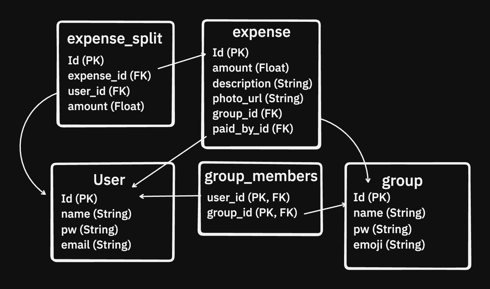

# MyCount Report

## Introduction
This project is a full-stack web application designed to help individuals both track and split their expenses within a group. It provides a structured backend for data management and a responsive and sleek frontend for user interaction.

## Core Features
1. **Group lifecycle API** — [View Endpoint](./backend/app/api/groups.py:23) — Allows users to create, join, and view shared expense groups through REST endpoints.

2. **Expense management API** — [View Endpoint](./backend/app/api/expenses.py:18) — Provides create/edit/delete routes for expenses so group balances stay accurate.

3. **JWT authentication & authorization** — [View Endpoint](./backend/app/api/auth.py:16) and [View Helpers](./backend/app/core/security.py:33) — Ensures only verified users get tokens and injects the current user into protected routes.

4. **Persistent data layer** — 
    - [View Models](./backend/app/db/models.py:9) — Maps users, groups, expenses, splits, and group invites to PostgreSQL tables for durable storage. 

    - [View DB Session](./backend/app/db/session.py:16) - Boots the SQLAlchemy engine with connection retries and exposes a FastAPI dependency for safe transaction handling

5. **UI** - [View App](./frontend/src/App.jsx) - Defines the Vite app ...

## Feature Catalog

1. **Balance calculation service** — [View Service](./backend/app/services/group_service.py:134) — Computes each member’s net position on the fly, ensuring the UI can quickly display each user's position without applying any of it's own logic or having to save this to a DB.

2. **Invite link tokens** — [View Service](./backend/app/services/group_service.py:158) — Generates unqiue and expiring invite URLs, making it easier to onboard new group members securely.

3. **Group access guard** — [View Feature](./backend/app/core/security.py:70) — Validates that the authenticated user belongs to the target group before any expense/group action runs.

4. **Custom exception layer** — [View Feature](./backend/app/core/exceptions.py:8) — Keeps service logic framework-agnostic and yields UX friendly error messages, allowing the frontend to include the error detail directly.

5. **Request-scoped logging** — [View Feature](./backend/app/core/logger.py:24) — Injects per-endpoint loggers to trace requests without polluting global logs.

6. **Frontend auth persistence** — [View Feature](./frontend/src/AuthContext.jsx:7) — Caches the token and user metadata in localStorage so sessions survive page reloads.

7. **API fetch helpers** — [View Feature](./frontend/src/services/api.js:14) — Centralizes authenticated requests and auto-logs users out on 401 responses.

8. **Test suite** — [View Tests](./backend/tests/) — Verifies all backend functionality, including all API routes, all services, and all security utils (password hashing, token expiry and group access rules)

## Tech Stack

### Technologies Used
- **Backend:** FastAPI (Python), SQLAlchemy (ORM), Pydantic (data validation & schemas), PostgreSQL (database), Alembic (database migrations)
- **Frontend:** React (JavaScript), Vite
- **Other Tools:** ERD for database design, Local Storage for persisting user data  

### Features
- User + Group creation and authentication  
- Persistent user sessions via local storage  
- Database integration with SQLAlchemy models  
- API endpoints defined with FastAPI and validated with Pydantic  
- Database migrations for updating schema using Alembic

---

## Software Development Life Cycle (SDLC) Model
This project follows the **Iterative Model** of the SDLC.  

### Why Iterative?
- Initial planning and design were done (system architecture, ERD, schemas)
- I began coding early to get a working prototype as soon as possible
- Development continues in small cycles: implement → test → refine → repeat

This approach balances planning with flexibility, which works best for my workflow and the scale of this project. I personally find it difficult to imagine the entire application and it's requirements at first, therefore I'd rather start developing ASAP and refine features later on.

**My Steps:**
1. Decide on backend + frontend technologies and create file structrue (with simple comments describing the purpose of each file)
2. Create first draft of ERD
3. Implement this on SQLAlchemy
4. Create rough draft of input and output models using Pydantic
5. Test app setup by creating the first simple API's (entity creation)
6. Quickly test these on the frontend by implementing simple API calls without any design
7. ...

---

## Database Design
Below is where the **Entity Relationship Diagram (ERD)** will be added to illustrate the database structure:

For reference, the database is implemented with:
- **Pydantic Schemas** for data validation [View Pydantic Schema](./backend/app/db/schemas.py)
- **SQLAlchemy Models** for persistence [View DB Schema](./backend/app/db/models.py)
